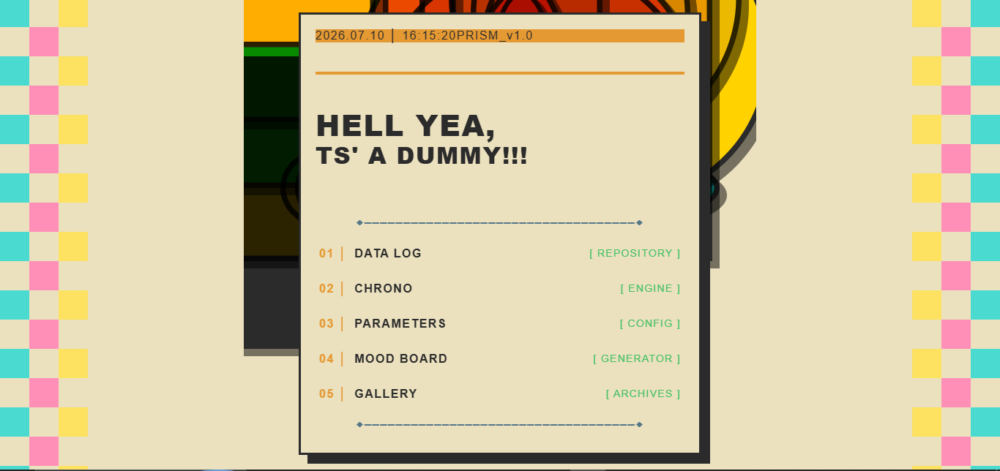
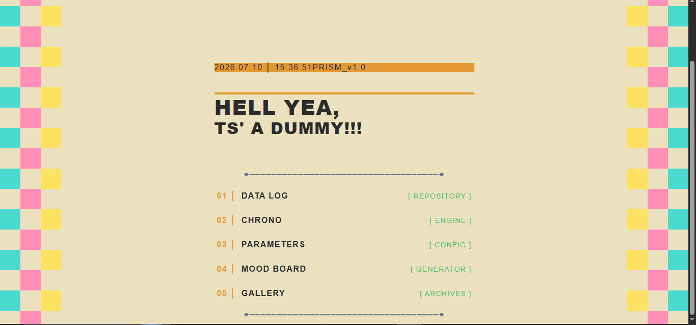
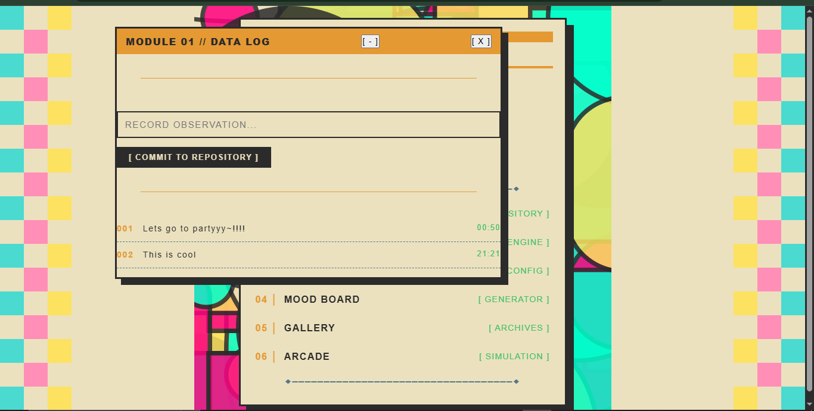
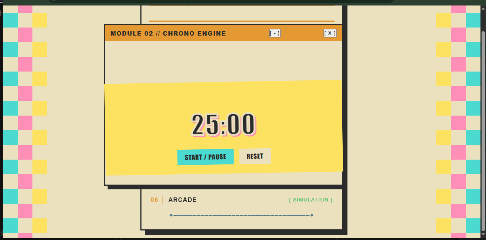
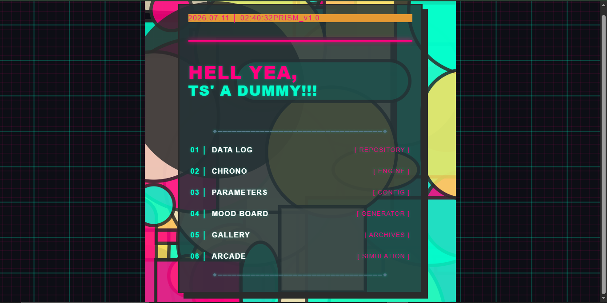
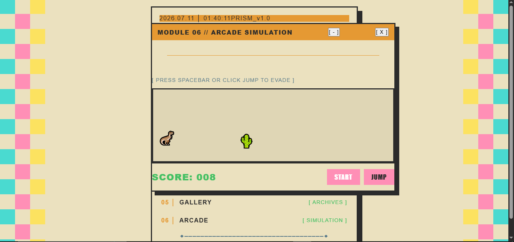

# Prism-OS

so I was messing around with design styles and thought what if I made a fake operating system that looks like a cotton candy machine threw up on a swiss design poster. thats basically this.

## what this is

its a browser-based OS simulation thing with 6 apps in it. boots up with a loading screen, drops you into a menu, and you can open little windows for each module. the whole vibe is cream/mustard/charcoal with pops of pink and teal; very art deco meets brutalism or whatever. also has a cyberpunk night mode if thats more your thing.

## the modules

This a notepad that saves to localStorage. write something, hit commit, it timestamps it and stores it. basically a repo for your thoughts i guess

Chrono is a pomodoro timer. looks ridiculous because i gave it this pop-art style display with a giant font and hot pink shadow. start, pause, reset. beeps when its done

Parameters is where you can switch themes. swiss day is the default cream look, cyberpunk night flips everything to dark with green and pink. the toggle button is the only setting.

Not spoiling the moodboard here cuz that one is fun. you check some boxes (geometric, neon, swiss) and hit generate and it scatters random colored blocks across a canvas. you can then set it as your wallpaper. the wallpaper actually persists if you refresh which i thought was neat n cool ofc.

The Gallery does pretty much nothing, just fake folder icons that all say corrupted or access denied except one that says welcome admin. just a little easter egg

And finally Arcade is the chrome dino game. i re-made it with emojis for the dino and cacti and birds. spacebar to jump, score counter. So yea a lil fun thing to try i guess.

## how i built it

- no frameworks just html/css/js. the window is draggable with mousedown events on the header. each app rewrites the innerHTML of a shared window div. the theme toggle slaps a class on the body and css cascading does the rest.

- the mood board generates divs at random grid positions which is probably a stupid way to do it but it works. sounds are web audio api oscillators, no audio files. dino game runs on css animations with a 10ms interval checking for collision.

- took me a while to get the wallpaper layering right because the generated art div was overlapping stuff weirdly. had to mess with z-index and positioning for a bit, but it came out good.

## stuff i used

- vanilla js
- html5 canvas and css
- web audio api
- localStorage for saving logs and wallpaper

## ai use

used ai to help debug the wallpaper layering bug and the collision detection in the dino game and help find typos.

## license

MIT
